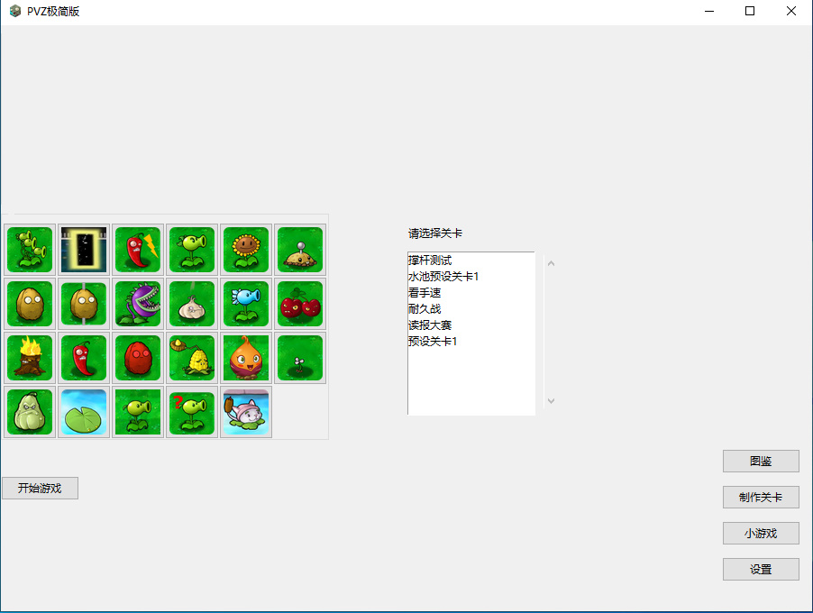
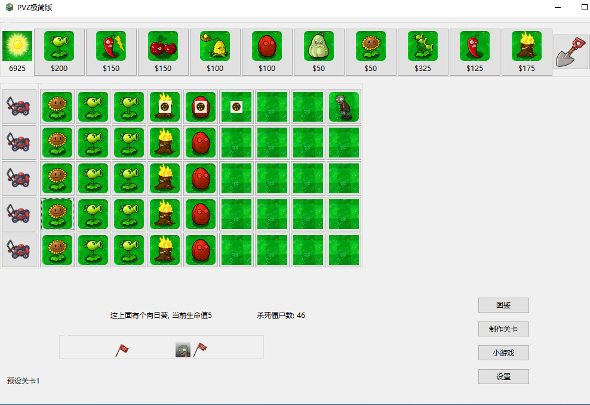

# PVZ Minimal

[中文](#PVZ极简版) English

Plants vs Zombies Minimal Edition, with the greatest freedom of game customization and gameplay designing

You can download the latest version [here](https://www.jianguoyun.com/p/DcEb38QQt43aDBirycoFIAA)

I recently wrote a minimalist version of Plants vs Zombies using tkinter in python, and it's almost finished. In this version, you can very simply modify all the plants and zombies game parameters, you can customize the level, you can make your own new plants, new zombies, and all the things in the game screen can be changed, including the map, background music and all the game sound, how to modify I will say next. I kind of wrote a pvz from scratch, all the game layout and zombie and plant game logic algorithm, all the game interface design, data structure are their own original, no reference to any source code. Not all the plants and zombies algorithms have been written yet, but it will be soon.

The upper left corner is the current sunlight obtained, and the upper right corner is the sunlight falling from the sky. Because it is a minimalist version, players can get sunlight by clicking directly on the sunlight when it appears in the upper right corner. The number of horizontal and vertical grids in the meadow can be modified by yourself. It is worth mentioning that this minimalist version has a current status bar at the bottom of the screen compared to the original version, which shows what you are currently doing (such as what plants are planted where, which grid has no plants, what plants are there), which plant in your current location has been eaten, whether you have enough sunlight to plant a plant, whether the plant is still cooling, etc. This status bar will give players a better idea of the overall situation of the game they are playing. Another difference is that the right side of this status bar will show the current number of zombies you have killed.

The zombie progress bar directly below is similar to the original design, and will change accordingly as you customize your level.

The current version of the game is structured to give each plant and each zombie a separate script file, and all plant script files are placed in the

plant_scripts folder, and all zombie scripts are placed in the zombie_scripts folder.

Each level also corresponds to a separate script file, and the script files for all levels are placed in the stages folder.

The resources folder is where all the game's images, music and sound effects are stored, i.e. the game's resources folder.

If you have scripts that need to modify parameters in bulk, you need to put them here, and then change modified_file to the script file name in the pvz_config configuration file.

In the resources folder there is also a common.py file, this is when reading the level, will go to the resources folder, this common.py script file

will do the pre-processing of the sound resources for each zombie.

Next I will explain in detail the data structure design of this minimalist version of pvz. If you want to make your own new plants and zombies, please be sure to read through it carefully.

First is the design of plant types. Each plant belongs to a plant type. The internal parameters of the plant type are as follows.

name,

img,

price, 

hp, 

cooling_time, 

hp_img, 

attack_interval, 

bullet_img, 

bullet_speed, 

bullet_attack, 

bullet_sound, 

sound_volume, 

self_attack, 

change_mode,

func,

bullet_func,

effects,

no_cooling_start,

is_bullet,

dead_normal,

img_transparent, 

rows, 

columns

I'll explain each of these parameters next.

name is the name of the plant, e.g. pea shooter, then name is "pea shooter".

img is the path to the plant's image file, which is how the plant will appear in the game, both on the card and after planting.

price is the price of the plant's sunlight.

hp is the plant's life value.

cooling_time is the plant's cooldown time in seconds.

hp_img is the picture that changes if a plant's life value is reduced to a certain amount, then it is set to

((percentage of life left 1, corresponding image path 1), (percentage of life left 2, corresponding image path 2), ...)

Here the percentage is not multiplied by 100, for example, the nut will become a gnawed picture when there are two-thirds left, that is, 66% of the blood, if the picture path is in "resources/bite.png", then here write ((2/3, "resources/bite.png"),).

If there is a plant that turns into half.png when it has half blood left, then it is ((0.5, "resources/half.png"),).

attack_interval is the attack interval of the plant in seconds, for example, a pea shooter fires a pea every 2 seconds, so here it is 2.

bullet_img is the picture path of the bullet fired by the plant.

bullet_speed is the movement speed of the bullet fired by the plant, in milliseconds (thousandths of a second). For example, if a pea shooter fires a pea that moves one frame every 0.2 seconds, then this is 200.

bullet_attack is the attack power of the bullets fired by the plant.

This minimalist version of PvZ's blood design is based on the attack power of a pea shooter's pea as a unit, that is, the pea shooter's pea attack power is 1, corresponding to the blood of ordinary zombies is 10, because in the original version of an ordinary zombie full blood state can just be pea hit 10 times. The pea shooter is usually gnawed by zombies 5 times without dropping, so the pea shooter's blood is 5 by default.

bullet_sound is the path of the sound file when the plant fires a bullet.

sound_volume is the sound size adjustment of the plant firing bullets, 1 is 100% volume (maximum volume), if it is 0.6 is 60% volume.

self_attack is the attack power of the plant itself (if any), for example, the big mouth flower has a large attack power itself.

About self_attack has not yet written the corresponding algorithm, the next write big mouth flower will be added to the game's general algorithm.

change_mode is the mode selection parameter in the previous hp_img to determine the life value. change_mode is 0 by default.

When change_mode is 0, the amount of blood less than or equal to the percentage will become the corresponding picture.

When the change_mode is 1, the blood volume becomes the corresponding image when it is less than or equal to a value.

When change_mode is 2, the picture will be the corresponding picture when the amount of blood is reduced by a value greater than or equal to one, that is, after how many times it has been chewed.

func is the algorithm that the plant runs in each loop of the game, and is a function with two parameters, the first parameter self is the plant itself, and the second parameter games is the game body.

With these two arguments you can achieve full interaction between the plant and the game body, and the player can make his own algorithm for new plants as he pleases. If one func is not enough, the

If one func is not enough, this func can call other functions by itself, just write them in the plant script.

bullet_func is a function that handles the bullet that was stopped when the game resumes after the player pauses, usually by continuing the same bullet movement function as before.

effects is a dictionary, the key is the type of effect a plant will have on other plants or bullets or zombies, and the corresponding value is a function that allows you to modify the parameters of the affected plant or bullet or zombie, or whatever you want.

The corresponding value is a function that allows you to modify the parameters of the affected plant or bullet or zombie or whatever you want to do. The affected plants or bullets or zombies need to be written in their own scripts with the corresponding detection section, usually in the func.

no_cooling_start is a boolean value, when it is True, the game is cooled down directly at the beginning of the game, and cooled down normally later. When it is False, the game cools down normally from the start. The default value is False.

Generally only sunflower this plant will use this parameter, sunflower no_cooling_start is True.

is_bullet is a boolean value. When it is True, the bullet_img of the plant will be scaled to one-third of the size of the ground image.

When it is False, it will not be scaled and will be at the original size. The default value is True.

dead_normal is a boolean value, when it is True, the plant will be judged as dead and disappear when its life value is less than or equal to 0, when it is False, it will not.

The player can set in the func what the plant will do when the life value is less than or equal to 0. The default value is True. (For example, if the plant is an exploding nut, this parameter should be set to False)

img_transparent is a boolean value, when True, the plant image will be treated as a transparent background image, and resized and positioned and ground image composite as the new plant image.

When False, the plant image is used directly without any processing. The default value is False.

rows is the number of rows where the plant is located, and columns is the number of columns where the plant is located, these two values together indicate the current position of the plant.

These are all the parameters of the plant, and all of them can be modified at will. In the pvz_config.py file, plant_dict, there are the plant parameters that I have finished writing so far, and they can be changed at will.

Next is the design of the zombie type. Each type of zombie belongs to the zombie type. The internal parameters of the zombie type are as follows.

name, 

img, 

hp, 

move_speed, 

attack, 

attack_speed, 

attack_sound, 

dead_sound, 

hit_sound, 

hit_sound_ls, 

hp_img, 

start_func,

eachtime_func,

repause_func,

other_sound,

img_transparent,

rows, 

columns, 

appear_time, 

change_mode

name is the name of the bot.

img is the file path of the zombie's image.

hp is the life value of the zombie. The unit of life value, as I said before on the plant side, is 1 for the attack power of a pea, so the life value of a normal zombie is 10 by default.

move_speed is the zombie's movement speed, how many seconds to move a grid (a whole grid of grass), for example, an ordinary zombie can walk through a whole grid of grass every 9 seconds, then move_speed is set to 9.

attack is the attack power of the zombie, each attack how much the opponent's life value reduction.

attack_speed is the attack speed of the zombie.

attack_sound is the path of the sound file when the zombie attacks.

dead_sound is the path of the sound file when the zombie dies.

hit_sound is the path to the sound file when the zombie is attacked by a plant.

hit_sound_ls is the path of the corresponding sound file after the zombie's life value is reduced to how much, written with reference to the previous plant's hp_img.

hp_img, also refer to the previous plant's hp_img.

start_func is what this zombie does when it appears in the game, players can import the default start_func from inside regular when writing the script, the default start_func in regular is zombie_move.

eachtime_func is what this zombie will do in every cycle of the game, the default inside regular is next_to_plants.

repause_func is what the zombie will do when the game is paused and resumes, and defaults to repause in regular.

other_sound is the sound that the zombie needs other than the sound of being attacked, the sound of the attack, and the sound of being defeated.

img_transparent refers to the img_transparent in plants.

rows and columns are the number of rows and columns of the zombie.

appear_time is the appearance time of the zombie after the game starts, in seconds, that is, how many seconds after the game starts the zombie will appear.

change_mode refers to the change_mode of the previous plants.

Here the data structure of plants and zombies is almost finished. In fact, the real complexity is the implementation of different plants and zombies game logic algorithm, but this data structure design, so I feel very smooth in the design of the algorithm, the organization is also very clear.

Next, let's start with the controls in the game. The left mouse button can do exactly the same things as the original, select plants, plant plants, eradicate plants, take sunlight, etc. In addition to that, there are many functions that the original version does not have, such as when the left mouse button clicks on a plant card, the status bar below will write which plant you have selected, and when you plant, the status bar below will write what plant you have planted in the first few rows and columns. When you click a piece of grass directly, the status bar below will show whether the current grid has any plants, and if so, what is on it. When you eradicate a plant, the status bar below will taunt you if there is no plant (laugh), and if there is a plant, the status bar will say what plant you eradicated in what location. When you click on sunlight, the status bar will show you how much sunlight you have gained.

The right mouse button cancels the currently selected thing. For example, if you select a plant to plant, tap the right mouse button to cancel it. When you select a shovel, tap the right button to cancel it as well. Press the spacebar on the keyboard to pause the game, and press P to continue the game.

The screen at the beginning of the game is for you to choose a plant, here is the same as the original version, directly click the plant card will see the selection to the card slot, tap the plant in the card slot to deselect this plant.

After selecting the plants, click Start Game to start.

All the game parameters can be modified in the file pvz_config.py, and here are some other game parameters.

background_music is the path to the game's background music file.

choose_plants_music is the background music of choose plants interface.

sunshine_img is the path to the sunshine image file.

There are very many other parameters, for example, you can even change the title of the game, the icon, and the picture of the map can also be changed, lawn_img that is the picture file path of the map.

Next, how to customize the level. In this version, in addition to the plant type and zombie type, there is also a level type. The initialization parameter for the level type is only one, that is, how many flags there are in total (that is, how many waves of zombies).

Now we create a new level with the name current_stage, because the main program reads the level variable name current_stage, so we fix current_stage here.

current_stage = Stage(2)

If we want to set a random number of 30 zombies to appear in a row within 1 minute before the first flag arrives, and the zombie type is chosen from normal zombies and roadblock zombies, then write part1 = [get_zombies(random.choice(['normal zombies', 'roadblock zombies',), random.randint(0, 4), 8, random.randint(1, 60)) for i in range(30)]. The first parameter of the get_zombies function is the name of the zombie, the second parameter is the number of rows in which the zombie appears, the third parameter is the number of columns in which the zombie appears, and the fourth parameter is the time (in seconds) in which the zombie appears. It is worth noting that the next wave of zombies will not appear until all the zombies in the current part1 wave have been beaten, which is also the same as the original version, so the starting reference point of the appearance time is the beginning of each wave of zombies, for example, when the second wave starts, the time from the second wave is the starting time. part1 is a list of 30 zombies, we now only We now only need current_stage.set_normal(0, part1) to set part1 to the zombies that appeared before the first flag.

If it is the time of the banner, that is, "a wave of zombies is coming", we also customize the zombies like part1, for example, called wave_1, and then just current_stage.set_waves(0, wave_1) can set wave_1 to the first banner. 1 is set to the zombie that appears at the first banner.

(For those who don't know programming, please note that 0 is generally used as the first in programming, so 0 represents the first wave, 1 represents the second wave, etc.)

As for making new plants and new zombies, then you may really have to know a little python 2333, or in fact, I was thinking, there is no way to make a program that allows users to easily develop a new plant and new zombie game algorithm by themselves, even if people who do not know how to program will write the kind of difficulty, and then I write an interpreter to translate it into python code. These algorithms can be saved as separate files and then just used inside the configuration file (pvz_config.py). For example, we want to write a new plant called apple, which looks delicious but is poisonous, and will make every zombie that eats it deduct some life value per second for the next 15 seconds, the amount of this deduction varies from 1 to 5 (randomly chosen). Each zombie will only take one bite of the apple and then walk right past it. This algorithm can be written very quickly as long as you know a little python, but it may not be so easy to design for people who don't know python, so it may be very convenient if I write an algorithm customizer. I'll try to write one next.

If the current level is won, the status bar below will show that you won, and then the game will close itself after 7 seconds. When a zombie enters the house, the status bar below shows you lost, then also after 7 seconds the game closes by itself.

This minimalist version of pvz currently allows you to make your own levels, and then open the game to select the level you want to play and start playing. I also wrote some mini-games for this version, and currently finished writing the original version in
Hammer Zombie and I Am Zombie (including custom levels and endless mode). In the game click the settings button to adjust the volume of the current soundtrack, the volume of the sound effects and the ability to change the background music. Will be added later
More features that can be set during the game.

# PVZ极简版

中文 [English](#PVZ-Minimal)

pvz极简版，完全原创，自由度最大的植物大战僵尸

你可以从[这里](https://www.jianguoyun.com/p/DcEb38QQt43aDBirycoFIAA)下载最新版本

最近用python的tkinter写了一个极简版的植物大战僵尸，目前完成度差不多了。在这个版本里，大家可以非常简单随意地修改所有植物和僵尸的游戏参数，可以自己定制关卡，可以自己制作新植物，新僵尸，而且所有游戏画面里的东西都可以改，也包括地图，背景音乐和所有游戏音效，如何修改我接下来会说。我算是从零开始写了一个pvz，一切游戏布局和僵尸和植物的游戏逻辑算法，全部的游戏界面设计，数据结构都是自己原创，没有参考任何源代码。目前还没有把所有的植物和僵尸的算法都写完，不过很快的。

左上角是当前得到的阳光，右上角是天上落下的阳光，因为是极简版，所以玩家直接在右上角出现阳光的时候点击就可以获得阳光。草地的横向纵向格子数量都可以自己修改。非常值得一提的是，这个极简版和原版相比，多了屏幕下方的一个当前状态显示栏，可以显示你当前正在做什么事情（比如在哪里种了什么植物，哪个格子上有没有植物，有什么植物），你当前哪个位置的植物被吃掉了，你的阳光够不够一个植物的种植，这个植物是否还在冷却等等。这个状态栏会让玩家更清楚自己正在玩的游戏的整体形势。另一个不一样的地方是这个状态栏右边会显示当前你杀死的僵尸数量。

正下方的僵尸进度条和原版设计得差不多，在你定制自己的关卡时，这个进度条也会相应做出改变。

目前的版本的游戏结构设计是给每个植物和每个僵尸一个独立的脚本文件，并且所有植物的脚本文件都放在

plant_scripts文件夹里，所有僵尸的脚本文件都放在zombie_scripts文件夹里。

每一个关卡也都对应着一个独立的脚本文件，所有关卡的脚本文件都放在stages文件夹里。

resource文件夹是存放游戏所有的图片，音乐，音效的文件夹，也就是游戏的资源文件夹，如果有需要批量修改参数的脚本

也需要放在这里，然后在pvz_config配置文件里把modified_file修改为脚本文件名即可。

在resource文件夹里还有一个common.py的文件，这个是在读取关卡时，会转到resource文件夹，这个common.py的脚本文件

会进行每种僵尸的音效资源的预处理。

接下来我会详细地说明这个极简版pvz的数据结构设计。想要自己制作新植物和新僵尸的人请务必要认真看完。

首先是植物类型的设计。每一种植物都属于植物类型。植物类型的内部参数如下：

name,

img,

price, 

hp, 

cooling_time, 

hp_img, 

attack_interval, 

bullet_img, 

bullet_speed, 

bullet_attack, 

bullet_sound, 

sound_volume, 

self_attack, 

change_mode,

func,

bullet_func,

effects,

no_cooling_start,

is_bullet,

dead_normal,

img_transparent, 

rows, 

columns

我接下来一一讲解这些参数。

name是植物的名字，比如豌豆射手，那么name就是"豌豆射手"。

img是植物的图片文件路径，也就是植物在游戏里出现的样子，包括卡牌上和种植之后。

price是植物的阳光价格。

hp是植物的生命值。

cooling_time是植物的冷却时间，单位为秒。

hp_img是如果一个植物的生命值减少到一定量后，图片会发生变化，那么就设置为

((生命值剩下的百分比1, 对应的图片路径1), (生命值剩下的百分比2, 对应的图片路径2), ...)

这里的百分比没有乘上100，比如坚果剩下三分之二，也就是66%的血的时候会变成被啃的图片，假如这个图片路径在"resources/bite.png"，那么这里就写((2/3, "resources/bite.png"),)。

假如有个植物剩下一半血的时候会变成half.png这个图片，那么就是((0.5,"resources/half.png"),)。

attack_interval是植物的攻击间隔，单位为秒，比如豌豆射手每隔2秒发射一个豌豆，那么这里就是2。

bullet_img是植物发射的子弹的图片路径。

bullet_speed是植物发射的子弹的移动速度，单位为毫秒（千分之一秒）。比如豌豆射手发射的豌豆每过0.2秒移动一格，那么这里就是200。

bullet_attack是植物发射的子弹的攻击力。

这个极简版pvz的血量设计是以一个豌豆射手的一个豌豆的攻击力作为单位，也就是说，豌豆射手的豌豆攻击力为1，对应的普通僵尸的血量为10，因为在原版里一只普通僵尸满血状态下刚好可以被豌豆打10下。豌豆射手一般被僵尸啃5下没掉，因此豌豆射手的血量默认为5。

bullet_sound是植物发射子弹时的声音文件路径。

sound_volume是植物发射子弹的声音大小调整，1为100%的音量（最大音量），假如是0.6就是60%的音量。

self_attack为植物本身的攻击力（如果有的话），比如大嘴花自身就有很大的攻击力。

关于self_attack目前还没有写相应的算法，接下来写大嘴花时会加入到游戏的普遍算法中。

change_mode是之前的hp_img里的判断生命值的模式选择参数。change_mode默认为0。

change_mode为0的时候，血量小于或等于百分比就变成对应的图片。

change_mode为1的时候，血量小于或等于一个值时就变成对应的图片。

change_mode为2的时候，血量减少的量大于或等于一个值时就变成对应的图片，也就是被啃了多少下之后。

func是植物在游戏每次的循环里运行的算法，是一个带有两个参数的函数，第一个参数self是植物自己，第二个参数games是游戏主体，

通过这两个参数就可以实现植物和游戏主体的全面互动，玩家自己制作新植物的算法时也可以随心所欲。如果一个func不够用的话，

这个func自己可以调用其他的函数，只需要写在植物脚本里就行了。

bullet_func是游戏在玩家暂停之后，继续游戏的时候对之前暂停时停下的子弹的后续处理函数，一般为继续之前同样的子弹移动函数。

effects是一个字典，键为一个植物对其他的植物或子弹或僵尸会产生的效果影响类型，对应的值为一个函数，可以把受到影响的植物或子弹或僵尸

的参数进行修改或者其他你想做的事情。会受到影响的植物或者子弹或者僵尸自己的脚本里也需要写上对应的探测部分，一般来说写在func里即可。

no_cooling_start是一个布尔值，为True的时候，游戏开局时直接冷却好，后面正常冷却。为False的时候，游戏从开局时就正常冷却。默认值为False。

一般只有向日葵这个植物会用到这个参数，向日葵的no_cooling_start是True。

is_bullet是一个布尔值，为True的时候，植物的bullet_img，也就是子弹图片会按照地面图片的三分之一尺寸进行缩放，

为False的时候则不会进行缩放，按照原尺寸。默认值为True。

dead_normal是一个布尔值，为True的时候，植物的生命值小于或等于0的时候会被判定为死亡并且消失，为False的时候不会，

玩家可以在func里设置生命值小于或等于0时这个植物要做什么事情。默认值为True。（比如爆炸坚果这个植物就需要这个参数设置为False）

img_transparent是一个布尔值，为True的时候，植物的图片会被当成背景透明的图片，并且调整好尺寸和位置和地面图片合成作为新的植物图片，

为False的时候直接使用植物的图片而不作任何处理。默认值为False。

rows是植物所在的行数，columns是植物所在的列数，这两个值共同表示当前植物的位置。

以上就是植物的所有参数，这些参数全部都可以随意修改。在pvz_config.py这个文件里的plant_dict，有目前我写完的植物参数，这些都可以随便改。

接下来是僵尸类型的设计。每一种僵尸都属于僵尸类型。僵尸类型的内部参数如下：

name, 

img, 

hp, 

move_speed, 

attack, 

attack_speed, 

attack_sound, 

dead_sound, 

hit_sound, 

hit_sound_ls, 

hp_img, 

start_func,

eachtime_func,

repause_func,

other_sound,

img_transparent,

rows, 

columns, 

appear_time, 

change_mode

name是僵尸的名字。

img是僵尸的图片的文件路径。

hp是僵尸的生命值。生命值单位我之前在植物那边说过，以一个豌豆的攻击力为1，因此普通僵尸的生命值默认为10。

move_speed是僵尸的移动速度，多少秒移动一格（一整个草地的格子），比如一只普通僵尸每过9秒可以走过一整格草地，那么move_speed就设置为9。

attack是僵尸的攻击力，每次攻击对方的生命值减少多少。

attack_speed是僵尸的攻击速度。

attack_sound是僵尸攻击时的声音文件路径。

dead_sound是僵尸死亡时的声音文件路径。

hit_sound是僵尸被植物攻击时的声音文件路径。

hit_sound_ls是僵尸的生命值减少到多少之后，对应的声音文件路径，写法参考之前植物的hp_img。

hp_img，也一样参考之前植物的hp_img。

start_func是这个僵尸在游戏里出现的时候做的事情，玩家在写脚本时可以从regular里面import默认的start_func，regular里默认的start_func是zombie_move。

eachtime_func是这个僵尸在游戏每次循环都会做的事情，在regular里面默认为next_to_plants。

repause_func是这个僵尸在游戏暂停后继续游戏时会做的事情，在regular里面默认为repause。

other_sound是僵尸需要的除被攻击的声音，攻击的声音，被打败时的声音之外的其他音效。

img_transparent参考植物里的img_transparent。

rows和columns是僵尸的行数和列数。

appear_time是僵尸在游戏开始之后的出现时间，单位为秒，也就是僵尸在游戏开始之后多少秒会出现。

change_mode参考之前植物的change_mode。

到这里植物和僵尸的数据结构就差不多说完了。其实真正复杂的是不同的植物和僵尸的游戏逻辑算法实现，不过这样的数据结构设计，让我在设计算法时很感觉很流畅，条理也很清晰。

接下来先说下游戏中的控制。鼠标左键可以做和原版一模一样的事情，选择植物，种植植物，铲除植物，拿阳光等等，除此之外还有很多原版没有的功能，比如鼠标左键点击植物卡片时，下面的状态栏会写你选择了哪种植物，当你种植时，下面的状态栏会写你把什么植物种在了第几行第几列。当你直接点击一块草地时，下面的状态栏会显示当前的格子有没有植物，如果有，会显示上面有什么。当你铲除植物时，如果没有植物，下面的状态栏会嘲讽你一句（笑），如果有植物，状态栏会写你铲除了什么位置的什么植物。当你点击阳光时，状态栏会显示你获得了多少阳光。

鼠标右键可以取消当前选择的东西。比如你选择了一个植物要种植，点右键就可以取消。当你选择了铲子，点右键也可以取消。按键盘上的空格键可以暂停游戏，按P继续游戏。

游戏一开始的画面是让你选择植物，这里跟原版是一样的，直接点击植物卡片就会看到选到卡槽中，在卡槽里点植物就可以取消选择这个植物。

选择完植物后，点击开始游戏就可以开始。

所有的游戏参数在pvz_config.py这个文件里都可以修改，这里再讲一些其他的游戏参数。

background_music是游戏的背景音乐文件路径。

choose_plants_music是选择植物界面的背景音乐。

sunshine_img是阳光的图片文件路径。

还有其他非常多参数，比如你甚至可以改游戏的标题，图标，还有地图的图片也可以改，lawn_img那个就是地图的图片文件路径。

接下来说如何定制关卡。在这个版本里，除了植物类型和僵尸类型以外，还有一个关卡类型。关卡类型的初始化参数只有一个，就是总共有几个旗帜（也就是有几大波僵尸）。

现在我们新建一个关卡，名字为current_stage，因为主程序读取的关卡变量名就是current_stage，所以这里就固定写current_stage。这样可以新建一个有两个旗帜的关卡：

current_stage = Stage(2)

假如我们要在第一个旗帜到来之前，设置在1分钟内随机的行数出现30只僵尸，僵尸类型从普通僵尸和路障僵尸里面选，那么就写part1 = [get_zombies(random.choice(['普通僵尸', '路障僵尸',), random.randint(0, 4), 8, random.randint(1, 60)) for i in range(30)]。这里需要讲下get_zombies这个函数，get_zombies函数第一个参数是僵尸的名字，第二个参数是僵尸出现的行数，第三个参数是僵尸出现的列数，第4个参数是僵尸出现的时间（单位为秒）。值得注意的是，在当前part1这波里的僵尸全部被打完之前，下一波僵尸不会出现，这里也是跟原版一样的，因此这个出现的时间的起始参照点就是每一波僵尸开始的时候，比如到第二波开始后，就是按照从第二波开始的时间为开始时间。part1是一个有30只僵尸的列表，我们现在只需要current_stage.set_normal(0, part1)就可以把part1设置为第一个旗帜之前出现的僵尸。

如果是到了旗帜的时候，也就是“一大波僵尸要来袭了”的时候，我们也和part1一样自己定制僵尸，比如叫做wave_1，然后只需要current_stage.set_waves(0, wave_1)就可以把wave_1设置为第一个旗帜的时候出现的僵尸。

（不懂编程的人请注意，一般编程里都是以0作为第一个，因此0就代表第一波，1代表第二波，等等）

至于制作新植物和新僵尸，那你可能真的得会一点python了2333，或者其实我也在想，有没有办法做一个程序可以让用户很轻松地自己制定一个新植物和新僵尸的游戏算法，即使不会编程的人也会写的那种难度，然后我自己写个解释器翻译成python代码。这些算法可以保存为独立的文件然后在配置文件（pvz_config.py）里面用到就可以。比如我们想写一个新植物叫做苹果，这个苹果看似好吃但是却有毒，会让每一个吃到苹果的僵尸在接下来的15秒内每秒扣一些生命值，这个扣的量从1到5之间不等（随机选择）。每个僵尸只会咬一口苹果，然后就直接走过去。这个算法只要会一点python，都很快就能写完，不过不会python的人，可能就不是那么容易设计了，如果我写个算法定制器，可能就很方便了。我接下来会试着来写一个。

如果当前的关卡打赢了，下面的状态栏会显示你赢了，然后过7秒后游戏自己关闭。僵尸进家的时候，下面的状态栏显示你输了，然后也是过7秒游戏自己关闭。

这个极简版的pvz里面目前可以自己制作关卡，然后打开游戏可以选择自己想要玩的关卡开始玩。我也为这个版本写了一些小游戏，目前写完了原版里的
锤僵尸和我是僵尸（包括定制关卡和无尽模式）。在游戏里点击设置按钮可以调整当前的背景音乐的音量，音效的音量以及可以改变背景音乐。后续会加入
更多可在游戏过程中设置的功能。
